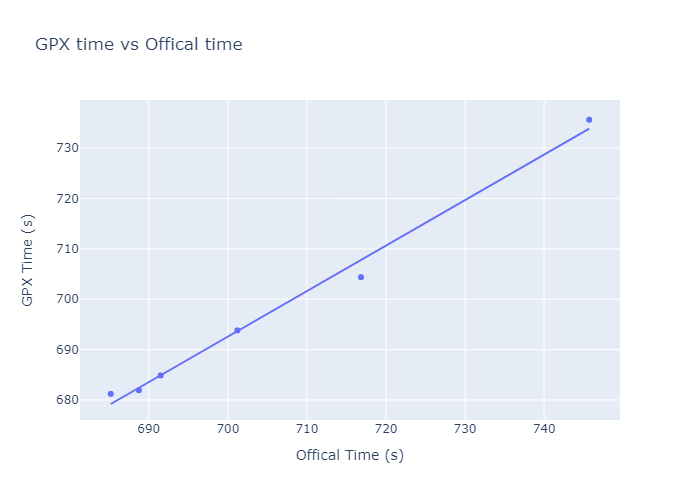

# GPX Splits Accuracy Analysis

GPS or more generally GNSS sports watches have become common place at both the elite and amateur levels as they have fallen in price over recent years. They provide helpful information to their users tracking aspects such as distance and speed which can be combined with other data such as heart rate to provide an insight into a users performance/training.

However there is a question into how accurate they are for tracking distance and for timing. STRAVA, the popular sports tracking app allows users to compete over segments. These are tracks marked out by users. Segments can vary in length but STRAVA only tracks the time over them to the nearest second, begging the question how valid is that 8s sprint segment.

Scientific literature on the accuracy of sports watches seems to be somewhat lacking. In a somewhat brief search I was only able to find one (article comparing sports watches and RTK)[https://link.springer.com/chapter/10.1007/978-3-030-94426-1_17] and a couple of interesting websites:
* https://www.trainingpeaks.com/blog/how-accurate-is-your-gps-watch/
* https://fellrnr.com/wiki/GPS_Accuracy

Usually when performing an analysis of a GNSS receiver's performance I would record a static test. In a static test the receiver is left to record for an extended period of time, usually at least an hour. This produces a distribution of positions, and from the spread of this distribution we can determine the random error of the receiver. To reveal standard errors or biases requires knowledge of an external truth but this is somewhat harder to gauge.

Unlike a standard GNSS receiver, sports watches tend to only output their position once there has been a significant change rather than at a fixed rate. This is likely an optimization to improve file sizes rather than something nefarious, but this does ruin the otherwise gaussian like position distribution we'd otherwise expect. As such, it is difficult to draw valid conclusions from such a static test.

In this analysis I've taken a different approach which is to compare the race time generated by a GPX split to an official race time at a Wildwater world cup.

The official race times at a Wildwater World Cup are measured by beam timing. This involves two laser beams across the start and the finish. The clocks between these two beams are synchronized and the race time is given as the elapsed time between the two beam breaks. This is officially given to a precision 0.01s.

The GPX time, works similarly finding the time between two 'virtual' beam breaks. These beams are specified as lines on the map projections. The intercept of this line and the GPX track is denoted as the beam break and the time at which this occurs is interpolated from the two adjoining GPX points, assuming a constant velocity.

Unfortunately as the precise location of the start and end beams used for the actual race is unknown, the location of the virtual beams has been approximated. When comparing the official time vs the GPX time we expect this to manifest as a systematic error between the two times (assuming constant athlete velocity).

In reality the athletes are not guaranteed to be of constant velocity, which will add to the random error of the GPX watch.

Despite these limitations the results from this brief assessment are surprisingly promising. The mean difference between GPX and official times (i.e.) the systematic error was -15.28s. This this indicates there was a significant discrepancy between the locations of the virtual beams and the real beams leading to the GPX times being shorter. Despite this error the standard deviation (or random error) of the time differences was only 2.96s. Given the size of the systematic error this is much better than I had anticipated and furthermore the GPX time managed to preserve the finishing order of all the athletes.

It should be noted that this brief 'study' is extremely limited given that only 6 data points could be sourced fro the British Team. If any other paddler who competed at either the Lipno World or Czech Cup races would like to contribute their GPX data, or improve the start and finish beam locations, that help would be greatly appreciated.

Overall the results give me reassurance that GPX splits can be used with relative confidence as a training aid. However with a standard deviation of 2.96s I would not use it for directly timing a race.

There is space for a more in depth study where beam locations are properly surveyed, participants briefed to improve data collection and other factors such as watch type are recoded. There's also scope to assess more advanced positioning techniques such as RTK or PPP which could provide the accuracy for timing races without deploying infrastructure.
